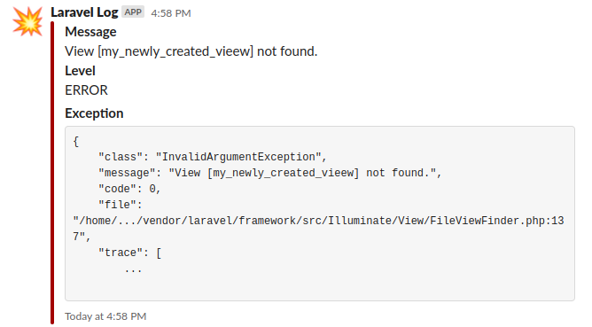
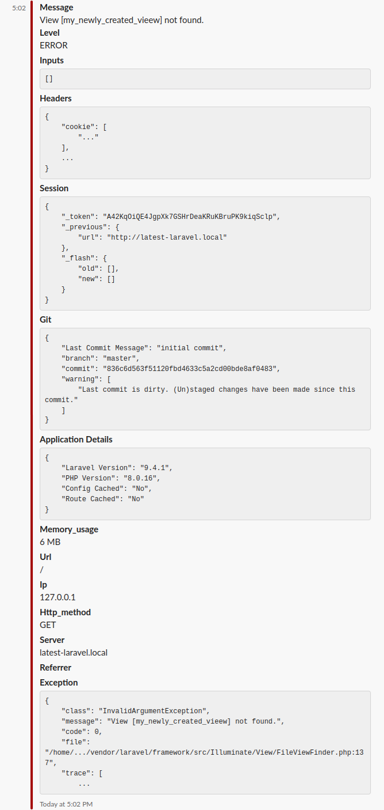

[](https://packagist.org/packages/freshbitsweb/laravel-log-enhancer)
[](https://packagist.org/packages/freshbitsweb/laravel-log-enhancer)
[](https://packagist.org/packages/freshbitsweb/laravel-log-enhancer)
[](https://styleci.io/repos/126970369)
[](https://plant.treeware.earth/freshbitsweb/laravel-log-enhancer)

# Laravel Log Enhancer (Laravel 5.6 to Laravel 12.x)
Laravel logs help all of us debug issues. We value them the most in production. But, the contextual data of the request is not logged by default. We need more than just *stack trace* to debug the issue easily. The things like **request URL**, **request input data**, **session data**, etc. help us hunt down the exact cause quickly. That's what this *plug-and-play* Laravel package does for you :)

## Before


## After


## Requirements
| PHP    | Laravel | Package |
|--------|---------|---------|
| 8.2+   | 12.x    | v2.0.0  |
| 8.2+   | 11.x    | v1.7.0  |
| 8.1+   | 10.x    | v1.6.0  |
| 8.0+   | 9.x     | v1.5.0  |
| 8.0+   | 9.x     | v1.4.0  |
| 7.3+   | 8.x     | v1.3.0  |
| 7.2.5+ | 7.x     | v1.2.0  |
| <7.2.5 | 6.x     | v1.1.0  |
| <7.1   | 5.x     | v1.0.*  |

**Notes**:
- For Laravel 5.5, you may use [Slack Error Notifier](https://github.com/freshbitsweb/slack-error-notifier) package.

## Installation

1) Install the package by running this command in your terminal/cmd:
```
composer require freshbitsweb/laravel-log-enhancer
```

2) Add this package's LogEnhancer class to the tap option of your log channel in **config/logging.php**:
```
'production_stack' => [
    'driver' => 'stack',
    'tap' => [Freshbitsweb\LaravelLogEnhancer\LogEnhancer::class],
    'channels' => ['daily', 'slack'],
],
```

Optionally, you can import config file by running this command in your terminal/cmd:
```
php artisan vendor:publish --tag=laravel-log-enhancer-config
```

It has following configuration settings:
* (bool) log_request_details => Set to *true* if you wish to log request data. [Reference](https://github.com/Seldaek/monolog/blob/master/src/Monolog/Processor/WebProcessor.php)

* (bool) log_input_data => Set to *true* if you wish to log user input data

* (bool) log_request_headers => Set to *true* if you wish to log request headers

* (bool) log_session_data => Set to *true* if you wish to log session data

* (bool) log_memory_usage => Set to *true* if you wish to log memory usage [Reference](https://github.com/Seldaek/monolog/blob/master/src/Monolog/Processor/MemoryUsageProcessor.php)

* (bool) log_git_data => Set to *true* if you wish to log git branch name, last commit message, last commit id, staged or (un)staged changes.

* (bool) log_app_details => Set to *true* if you wish to log application data. It will include Laravel Version, PHP Version, Config Cached and Route Cached details.

* (array) ignore_input_fields => If input data is being sent, you can specify the inputs from the user that should not be logged. for example, password,cc number, etc.

## Lumen compatibility

We do not use Lumen in any of our projects. And this package is not tested with Lumen framework.
If you are [willing](https://github.com/freshbitsweb/laravel-log-enhancer/issues/15) [to](https://github.com/freshbitsweb/laravel-log-enhancer/issues/16) use this package with Lumen, please help us by testing and making a PR to make it work. Thanks.

## Authors

* [**Gaurav Makhecha**](https://github.com/gauravmak) - *Initial work*

See also the list of [contributors](https://github.com/freshbitsweb/laravel-log-enhancer/graphs/contributors) who participated in this project.

## License

This project is licensed under the MIT License - see the [LICENSE](LICENSE) file for details

## Treeware

You're free to use this package, but if it makes it to your production environment I would highly appreciate you buying the world a tree.

It’s now common knowledge that one of the best tools to tackle the climate crisis and keep our temperatures from rising above 1.5C is to <a href="https://www.bbc.co.uk/news/science-environment-48870920">plant trees</a>. If you contribute to our forest you’ll be creating employment for local families and restoring wildlife habitats.

You can buy trees at for our forest here [offset.earth/treeware](https://plant.treeware.earth/freshbitsweb/laravel-log-enhancer)

Read more about Treeware at [treeware.earth](http://treeware.earth)

## Special Thanks to

* [Laravel](https://laravel.com) Community
